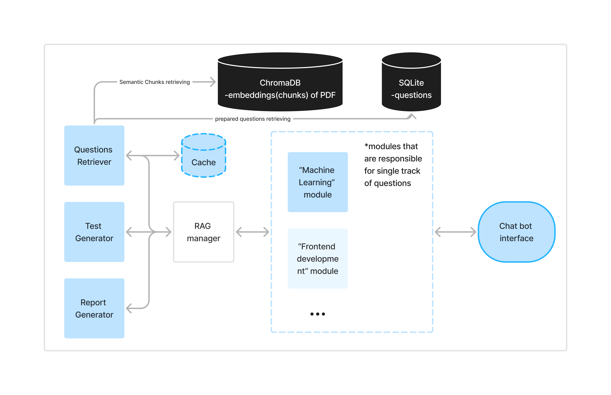

# InterviewPreparationBot

## Overview
This project is a comprehensive Telegram bot designed to aid users in IT-interview preparation. Leveraging advanced modular Retrieval-Augmented Generation (RAG) techniques, the bot generates relevant questions, creates full tests, and provides detailed reports based on user responses. The system is built for robustness, incorporating features like error handling retries and caching for seamless user experience.

### Author
Nazgul Salikhova, B22-AAI-02

## Features
- **Generate Questions**: Users can request questions on specific IT themes.
- **Full Test Creation**: The bot assembles a complete test based on selected tracks (e.g., Machine Learning, Frontend Development).
- **Detailed Reports**: Generates performance reports based on user answers, including scores and recommendations.
- **Error Handling with Retries**: Ensures stability by retrying operations up to 3 times if an error occurs.
- **Caching**: Speeds up response by storing generated questions.
- **Automated Benchmark Testing**: Enhances reliability through continuous testing.

## System Architecture
The architecture employs modular RAG for handling data retrieval and response generation. The workflow includes:

1. **ChromaDB**: Stores and retrieves semantic chunks of educational content.
2. **SQLite**: Maintains a database of questions.
3. **Modules**:
   - **Questions Retriever**: Gathers relevant questions from the cache or database.
   - **Test Generator**: Constructs comprehensive tests.
   - **Report Generator**: Produces detailed feedback reports.
4. **RAG Manager**: Manages interactions between components and handles error retries.
5. **Chat Bot Interface**: Facilitates user interaction.

*See system diagram for detailed workflow.*
<br>
<br>

## Technologies Used
- **Programming Language**: Python
- **Databases**: ChromaDB, SQLite
- **LLM Models**: gemini-1.5-flash-latest, llama-3.1-70b-versatile
- **Embedding Model**: all-MiniLM-L6-v2
- **Bot Framework**: python-telegram-bot

## Techniques Implemented
- **Prompt Engineering**: Customized prompts for generating educational content.
- **Modular RAG**: Ensures efficient data retrieval and content generation.
- **Semantic Chunking**: Splits and indexes PDF content for better context.
- **Error Handling Retry**: Retries failed operations up to 3 times for reliability.
- **Caching**: Reduces redundant processing and accelerates responses.
- **Automated Benchmark Testing**: Validates the bot’s functionality continuously.

## Getting Started
1. Clone the repository:
   ```bash
   git clone https://gitlab.pg.innopolis.university/llm-course/n.salikhova.git

2. Go into week4 repo
   ```bash
   cd final-project

3. Set up virtual environment (recommended):
   ```bash
   python -m venv venv
   source venv/bin/activate  # On Windows use `venv\Scripts\activate`

4. Install the required Python packages:
   ```bash
   pip install -r requirements.txt

4) Create a .env file in the root directory of your project with the following content:
   ```bash
   TELEGRAM_TOKEN=your_telegram_bot_token
   GEMINI_API_KEY=your_gemini_api_key
   GROQ_API_KEY=your_groq_api_key

•	For the TELEGRAM_TOKEN, contact @BotFather on Telegram to create a new bot and obtain the token.

•	For the GEMINI_API_KEY, visit [Google AI Studio](https://aistudio.google.com) to generate an API key.

•	For the GROQ_API_KEY, visit [qrogcloud](https://console.groq.com/keys) to generate an API key.

5) Run the script for local ChromaDB database in terminal:
    ```bash
   chroma run --path ~/chromadb_data

6) Start the bot by running the following command in another terminal:
   ```bash
   python main.py
---
## License
This project is licensed under the MIT License.
